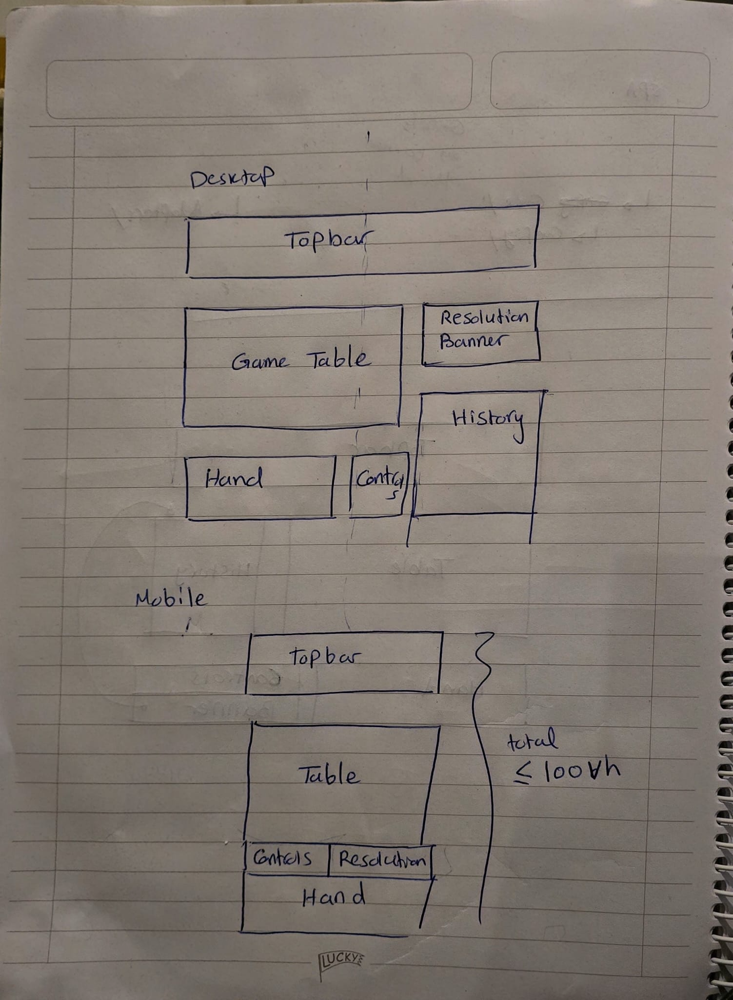

# Mahjong Tiles Game

A technical assessment for [Penny Software](https://penny.co)

- [Problem Statement](./docs/TASK.md)
- [Detailed Iterative Thought Process](./docs/THOUGHTS.md)
- [Full Project Architecture](./docs/ARCHITECTURE.md)
- [Video]()

## About Project

- The Project is using Hexagonal-liek Architecture (ports and adapters)
- For the sake of simplicity, we are using localStorage as a database, and a separate [server](./src/server/) to mimic a fullstack application. However, the application is ready to be migrated to a real backend
- Since no tech stack was mentioned in the task document, I decided to go with:
    - Typescript (Backend)
    - Vue.js (UI), Pinia (State Management), Vue Router (navigation) \[all using TypeScript\]
    - Bun (Runtime environment, package manager & bundler)
- The task had a lot of uncertainities, as per Penny's instructions. I assumed whatever missing, and kept in mind to make the design as scalable as possible, specially the server logic

## Quick start

- Install [bun](https://bun.sh)
- Open your terminal and run:

```bash
git clone https://github.com/AbRahman-ra/mahjong-game
cd mahjong-game
```

- install dependencides (after installing bun)

```bash
bun install
```

- Launch the project

```bash
bun run dev
```

## General Thought Process

### Backend Architecture (Hexagonal-like, Event based architecture)


### Frontend UI Low Fidelity Design



## Development

- Models used: Claude Sonnet 4.6

### AI Contributions

- Providing code snippets
- Many times was complicating easy staff

### My Contributions

- Make sure the snippets are readable (relatively small, low cognitive load)
- Make sure the code follows the architecture
- If we got stuck in a feature (like the cards animation), I make sure to get an easy solution (AI can easily take advantage of not knowing concepts and complicate things)

### Examples for AI's Unnecessary Complications

- After betting, the current hand should be updated with the new cards
    - Claude solution: Create a hidden `div`, that contains the next hand's element, expose this div and then control it using the component parent and composables
    - My solution: accept an optional boolean flag as a component prop, and add a simple condition in the component whether to render current hand or next hand
- All files in [`css/`](./src/client/ui/css/) were one file when Claude proposed them
- The animation from current hand to discard pile was a disaster before I came up with the solution (as steps)
