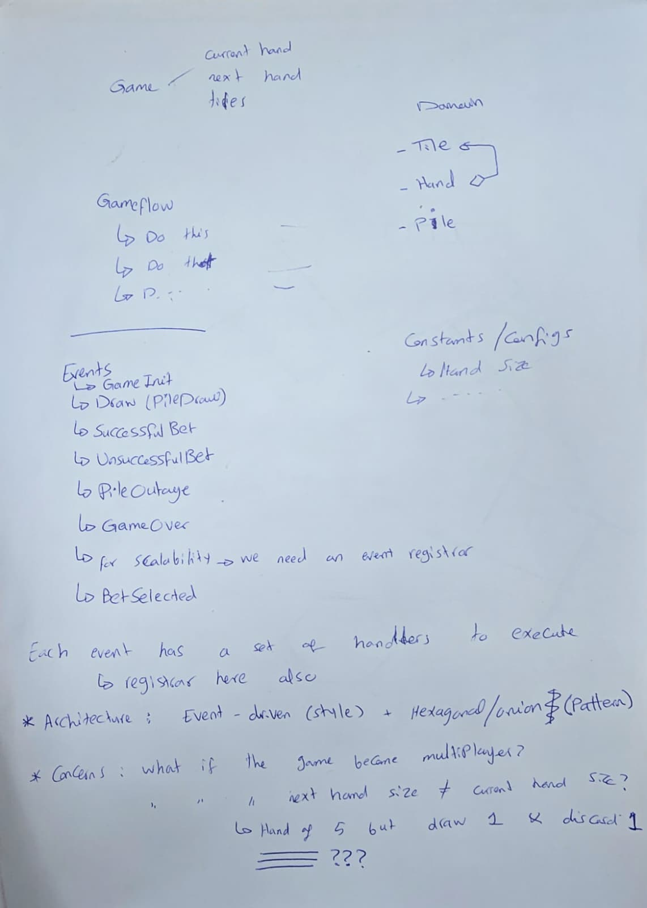
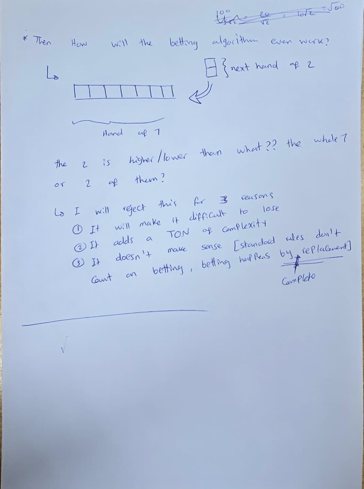

# Iteratve Thought Process on the Task

## Note: This document it 100% human written, no LLMs are used to generate this file

## 1st Milestone: Read the Task

- I don't know what are Mahjong Tiles
- There is no stack mentioned to write the app in

### Let's try to understand things better

- Let's watch this video [Easiest Mahjong tutorial (for beginners)](https://www.youtube.com/watch?v=pka0nVIahb0)
- A quick video to validate my understanding [Learn how to play mahjong in 2.5 minutes](https://www.youtube.com/watch?v=qpYF-xmNMew)

### Reread the task again

- Feedback: 50% understanding, let's dig deeper
    - What are the names of each tile set? What are dragons, winds, numbers? [Answer](https://en.wikipedia.org/wiki/Mahjong_tiles#Contents)
- From [this page](https://en.wikipedia.org/wiki/Mahjong#Other_variants) and [this page](https://en.wikipedia.org/wiki/American_mahjong) it seems there are multiple variants of the game, so, it's time for AI help 😁

### Unclear problem statement

- There were unclear questions
    - What are the winning conditions?
    - How much is the hand (i.e how many tiles drawn per turn)?
    - What is the tile distribution? i.e How many copies of each tile?
    - What happens if two hands have equal total value (tie)?
    - Does the player lose immediately after a wrong bet? Or continues until the game over / win / lose conditions
- Penny's answer:
    ```
    Hi Abdurrahman,
    Feel free to assume the answers following the standard rules wherever possible.
    ```

**So, we will ask AI for some assumptions**

- chats are in [this file](AI.md)

### The end

- Since there is no tech stack mentioned, claude suggests to use Vue + pinia
- Claude suggests to make the application as an SPA (with no backend) since the deadline is quite tight

---

## 2nd Milestone: plan the architecture

- The thoughts are evolving around core/shell concept (hexagonal, onion, clean) with events
- Seaprating logic from component allows to create a scalable and decoupled logic 
- What's better than a paper and a pen for brainstorming?



